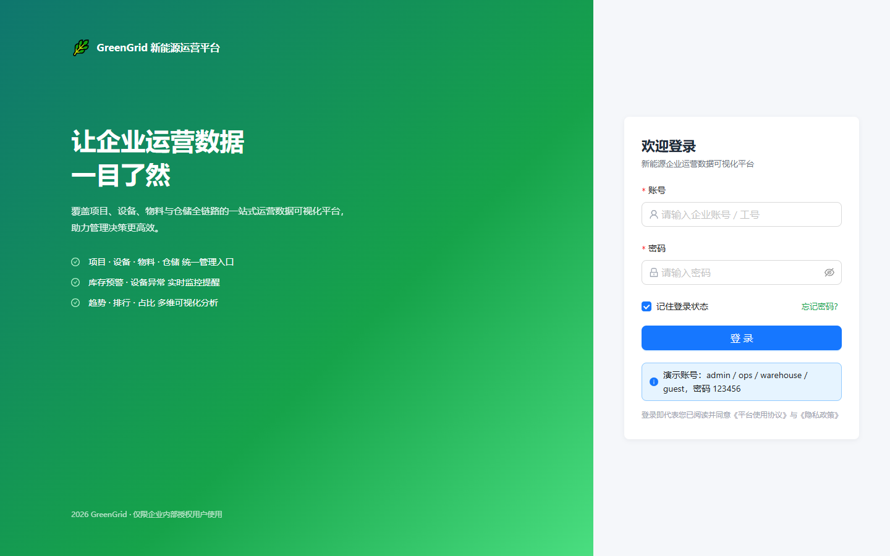
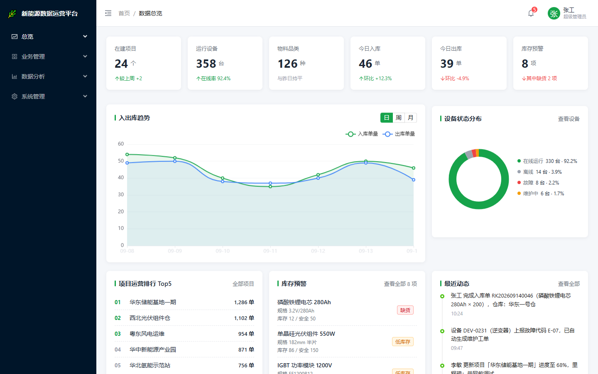
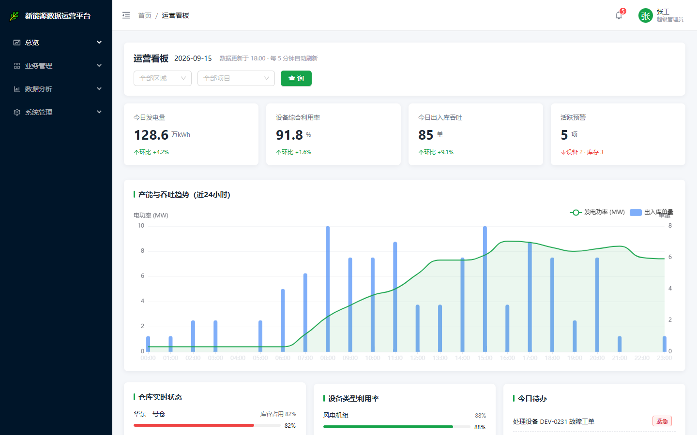
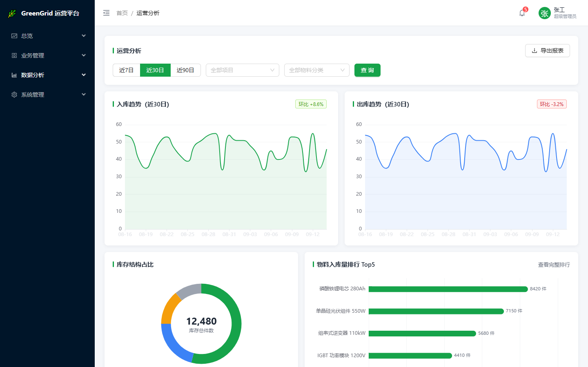
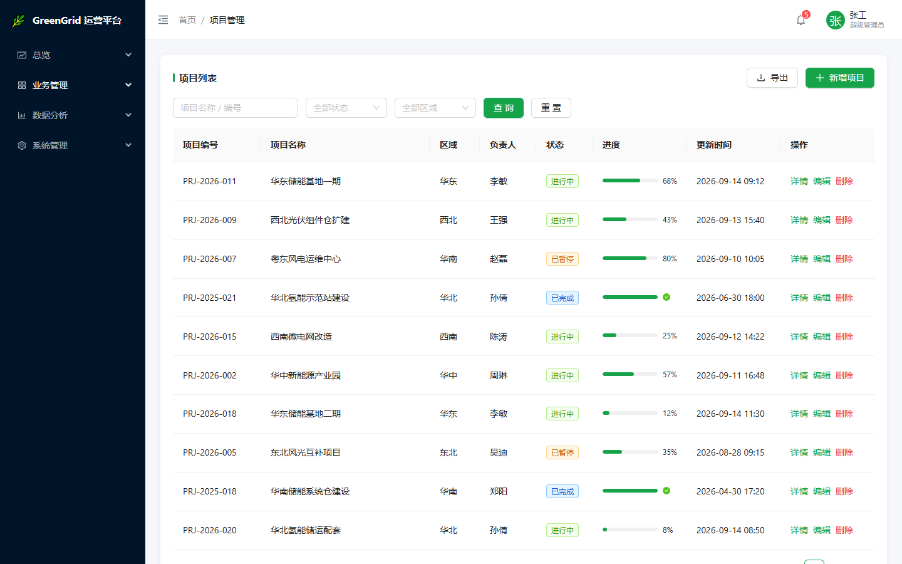
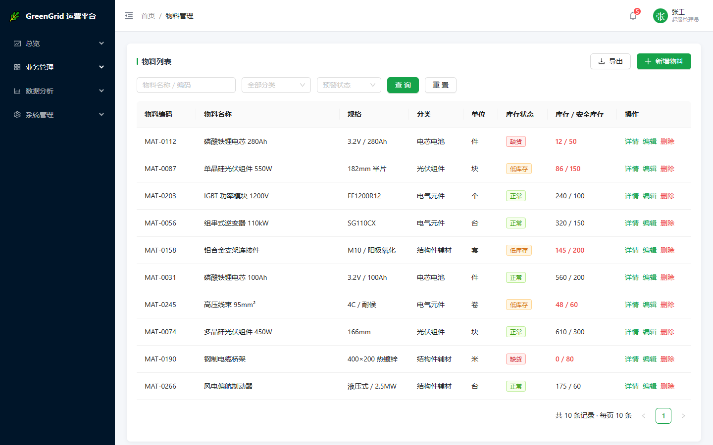
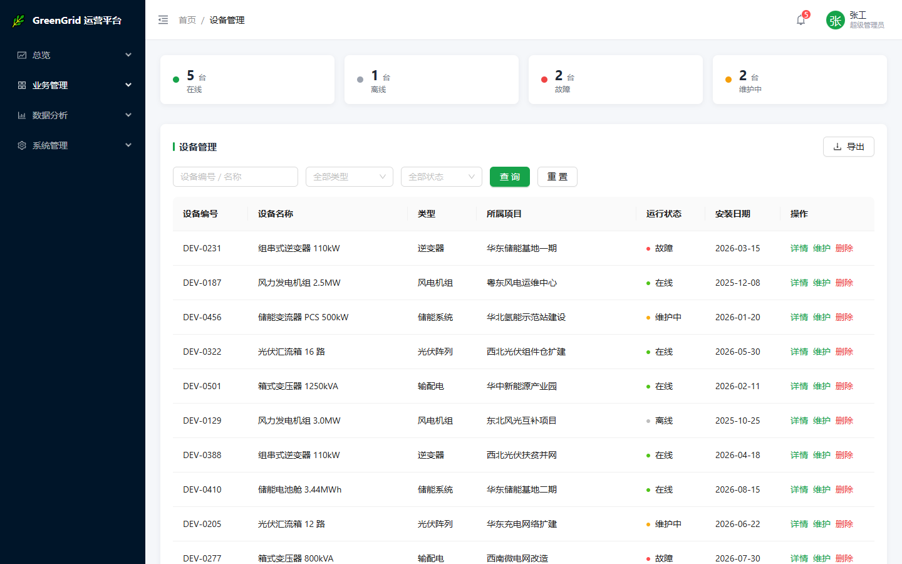
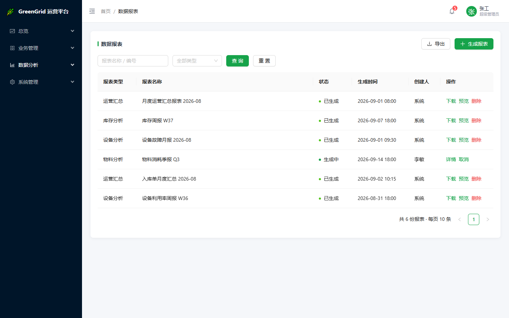

<div align="center">


# GreenGrid 新能源企业运营数据可视化平台

**面向新能源企业的一站式运营数据可视化中后台系统**

覆盖项目 · 设备 · 物料 · 仓储 · 数据分析全链路，助力管理决策更高效

[](https://vuejs.org/)
[](https://vitejs.dev/)
[](https://www.typescriptlang.org/)
[](https://antdv.com/)
[](https://echarts.apache.org/)
[](https://pinia.vuejs.org/)
[](#开源协议)

</div>

---

## 目录

- [项目简介](#项目简介)
- [在线预览与截图](#在线预览与截图)
- [功能特性](#功能特性)
- [技术栈](#技术栈)
- [目录结构](#目录结构)
- [环境要求](#环境要求)
- [快速开始](#快速开始)
- [环境变量](#环境变量)
- [可用脚本](#可用脚本)
- [项目架构](#项目架构)
- [路由与页面](#路由与页面)
- [组件与状态管理](#组件与状态管理)
- [接口与数据](#接口与数据)
- [样式与主题](#样式与主题)
- [权限与登录](#权限与登录)
- [构建与部署](#构建与部署)
- [代码规范与提交规范](#代码规范与提交规范)
- [常见问题 FAQ](#常见问题-faq)
- [贡献指南](#贡献指南)
- [版本记录](#版本记录)
- [开源协议](#开源协议)
- [联系方式](#联系方式)
- [致谢](#致谢)

---

## 项目简介

**GreenGrid 新能源企业运营数据可视化平台**（仓库名 `greengrid-admin`）是一个前后端分离的**纯前端**企业级中后台项目，面向新能源行业的运营管理场景。系统以「数据总览 — 运营看板 — 业务管理 — 数据分析 — 系统管理」为主线，提供项目、设备、物料、仓储等业务数据的可视化呈现与日常维护能力。

项目当前基于**本地 Mock 数据**运行，无需后端服务即可完整启动并演示全部功能；接入真实后端时只需替换请求层适配器配置，业务代码无需改动。

> **设计原则**：卡片化 Bento 布局 · 品牌绿主题 · 8px 基础间距体系 · 桌面端优先 + 响应式降级 · 仅适配 WebKit 内核浏览器（不兼容 IE）。

---

## 在线预览与截图

- **在线预览**：<https://<你的预览地址>/>（待部署后补充）
- **演示环境**：本地 `npm run dev` 启动后访问 <http://localhost:5180>

### 界面截图

| 登录页 | 数据总览 |
| :---: | :---: |
|  |  |

| 运营看板 | 运营分析 |
| :---: | :---: |
|  |  |

| 项目管理 | 物料管理 |
| :---: | :---: |
|  |  |

| 设备管理 | 数据报表 |
| :---: | :---: |
|  |  |

> 截图文件位于 `screenshots/` 目录，可按需替换。

### 测试账号

| 账号 | 密码 | 角色 | 菜单权限范围 |
| :--- | :--- | :--- | :--- |
| `admin` | `123456` | 超级管理员 | 全部菜单 |
| `ops` | `123456` | 运营管理员 | 总览 / 业务管理 / 数据分析 |
| `warehouse` | `123456` | 仓储管理员 | 总览 / 物料管理 / 运营分析 |
| `project` | `123456` | 项目管理员 | 总览 / 项目 / 设备管理 |
| `guest` | `123456` | 普通用户 | 仅总览 |

> ⚠️ 以上均为 **Mock 演示账号**，仅用于本地开发与演示，请勿用于生产环境。

---

## 功能特性

### 数据总览

- 6 项核心 KPI 卡片（在建项目、运行设备、物料品类、今日入库/出库、库存预警），数值带 GSAP 滚动动画与环比趋势标识
- 入出库趋势折线图，支持「日 / 周 / 月」维度切换
- 设备状态分布环形图 + 图例明细（在线率可视化）
- 项目运营排行 Top5、库存预警列表、最近动态时间线

### 运营看板

- 区域 / 项目条件筛选与查询
- 4 项看板 KPI，**宽屏一行 4 个、窄屏自动两行两列**，卡片等高对齐
- 近 24 小时产能与吞吐双轴图（折线 + 柱状）
- 仓库实时库容状态（进度条 + 超限告警）、设备类型利用率、今日待办

### 业务管理

- **项目管理**：筛选、分页、新增 / 编辑弹窗、详情抽屉（含关联设备）、删除二次确认
- **设备管理**：状态统计卡、详情抽屉含负载与温度监控趋势、维护与删除
- **物料管理**：缺货 / 低库存自动预警标记、详情抽屉含出入库记录追溯

### 数据分析与系统管理

- **运营分析**：近 7 / 30 / 90 日趋势面积图、库存结构环形图、入库量 Top5 条形图
- **数据报表**：报表生成、结构化预览（数据表 + 图表）、取消与删除
- **用户与权限**：角色标签、禁用 / 启用、重置密码
- **操作日志**：按模块与操作类型筛选、详情抽屉展示完整内容

### 工程能力

- 🔐 **路由级权限控制**：基于角色的菜单过滤 + 路由守卫双重校验
- 🎨 **主题定制**：Ant Design Vue 4 通过 `ConfigProvider` 注入品牌绿主题令牌
- ⚡ **性能优化**：页面路由懒加载、ECharts 按需注册、大依赖手动分包（vendor / antd / charts / anim）
- 📱 **响应式适配**：< 768px 自动收起侧边栏、隐藏登录页品牌区、看板 KPI 两行两列
- 🌐 **统一请求层**：Axios 实例 + Token 注入 + 响应拦截 + Mock 适配器分发，300ms 模拟网络延迟

---

## 技术栈

### 运行时依赖

| 依赖 | 版本 | 说明 |
| :--- | :--- | :--- |
| [vue](https://vuejs.org/) | ^3.5.13 | 核心框架，全面使用 `<script setup>` 组合式 API |
| [vue-router](https://router.vuejs.org/) | ^4.5.0 | 路由管理，History 模式 + 全局守卫 |
| [pinia](https://pinia.vuejs.org/) | ^2.3.0 | 状态管理，管理用户会话与权限 |
| [ant-design-vue](https://antdv.com/) | ^4.2.6 | UI 组件库（v4 为 CSS-in-JS 主题模式） |
| [@ant-design/icons-vue](https://antdv.com/components/icon-cn) | ^7.0.1 | 图标库 |
| [echarts](https://echarts.apache.org/) | ^5.6.0 | 数据可视化图表（按需注册，Tree Shaking） |
| [gsap](https://gsap.com/) | ^3.12.7 | 高性能动画引擎（卡片入场、数字滚动） |
| [axios](https://axios-http.com/) | ^1.7.9 | HTTP 客户端，统一封装与拦截 |

### 开发依赖

| 依赖 | 版本 | 说明 |
| :--- | :--- | :--- |
| [vite](https://vitejs.dev/) | ^6.0.7 | 构建工具，开发服务器端口 `5180` |
| [@vitejs/plugin-vue](https://github.com/vitejs/vite-plugin-vue) | ^5.2.1 | Vue 单文件组件支持 |
| [typescript](https://www.typescriptlang.org/) | ^5.7.3 | 类型系统 |
| [sass](https://sass-lang.com/) | ^1.83.4 | SCSS 预处理，全局变量与 mixin 注入 |
| [unplugin-auto-import](https://github.com/unplugin/unplugin-auto-import) | ^19.1.0 | 组合式 API 与组件自动引入 |
| [unplugin-vue-components](https://github.com/unplugin/unplugin-vue-components) | ^28.0.0 | Ant Design Vue 按需自动引入 |
| [@types/node](https://www.npmjs.com/package/@types/node) | ^22.10.5 | Node 类型定义（供 vite.config 使用） |

---

## 目录结构

```
greengrid-admin/
├── public/
│   └── favicon.ico               # 站点图标（favicon）
├── screenshots/                  # 项目界面截图（README 引用）
├── src/
│   ├── api/                      # 接口层：按业务模块封装请求方法
│   │   ├── auth.ts               #   认证：登录
│   │   ├── dashboard.ts          #   总览 / 看板 / 分析聚合接口
│   │   ├── project.ts            #   项目管理接口
│   │   ├── device.ts             #   设备管理接口
│   │   ├── material.ts           #   物料管理接口
│   │   ├── report.ts             #   数据报表接口
│   │   └── system.ts             #   用户与权限 / 操作日志接口
│   ├── assets/                   # 静态资源（SVG 等）
│   ├── components/               # 全局公共组件
│   │   └── KpiCard.vue           #   KPI 指标卡片（含 GSAP 数字滚动）
│   ├── composables/              # 组合式函数（可复用逻辑）
│   │   └── useChart.ts           #   ECharts 实例化 / 自适应 / 销毁
│   ├── layout/                   # 布局层
│   │   ├── BasicLayout.vue       #   主布局：侧边栏 + 顶栏 + 内容区
│   │   └── components/
│   │       ├── SideMenu.vue      #   分组侧边栏（按角色过滤）
│   │       └── TopHeader.vue     #   顶栏：面包屑 / 通知 / 用户操作
│   ├── mock/                     # Mock 数据层
│   │   ├── data.ts               #   静态数据源与趋势生成器
│   │   └── index.ts              #   Mock 路由表（方法 + 路径匹配）
│   ├── router/
│   │   └── index.ts              # 路由表 + 登录守卫 + 角色权限校验
│   ├── stores/
│   │   └── userStore.ts          # 用户状态：登录态 / 角色 / 退出
│   ├── styles/                   # 样式体系（SCSS 模块化）
│   │   ├── _variables.scss       #   主题色 / 尺寸 / 间距变量
│   │   ├── _mixins.scss          #   通用 mixin（flex / 省略号等）
│   │   └── base.scss             #   全局重置、工具类、滚动条、过渡
│   ├── types/
│   │   └── index.ts              # 业务实体与分页类型定义
│   ├── utils/
│   │   └── request.ts            # Axios 封装 + Mock 适配器
│   ├── views/                    # 页面层（按业务模块划分）
│   │   ├── login/LoginView.vue         # 登录页
│   │   ├── dashboard/HomeView.vue      # 数据总览
│   │   ├── board/BoardView.vue         # 运营看板
│   │   ├── project/ProjectList.vue     # 项目管理
│   │   ├── device/DeviceList.vue       # 设备管理
│   │   ├── material/MaterialList.vue   # 物料管理
│   │   ├── analytics/AnalyticsView.vue # 运营分析
│   │   ├── report/ReportList.vue       # 数据报表
│   │   └── system/
│   │       ├── UserManage.vue          # 用户与权限
│   │       └── LogList.vue             # 操作日志
│   ├── App.vue                   # 根组件（主题注入 + 路由过渡）
│   └── main.ts                   # 应用入口
├── .env.example                  # 环境变量示例（按需创建）
├── index.html                    # HTML 模板
├── package.json                  # 依赖与脚本
├── tsconfig.json                 # TypeScript 配置
├── vite.config.ts                # Vite 构建配置
└── README.md
```

---

## 环境要求

| 项目 | 要求 | 说明 |
| :--- | :--- | :--- |
| Node.js | `>= 18.0.0`（推荐 `>= 20.0.0`） | Vite 6 要求 Node 18+，推荐使用 LTS 版本 |
| 包管理器 | `npm >= 9` / `pnpm >= 8` / `yarn >= 1.22` | 项目自带 `package-lock.json`，**推荐 npm** |
| 操作系统 | Windows / macOS / Linux | 无平台特定依赖 |
| 浏览器 | Chrome / Edge / Safari 等 WebKit 内核（含 Chromium 内核） | **不兼容 IE**，样式统一添加 `-webkit-` 前缀 |

检查本地版本：

```bash
node -v
npm -v
```

---

## 快速开始

### 1. 克隆仓库

```bash
git clone <仓库地址>
cd greengrid-admin
```

### 2. 安装依赖

```bash
# 使用 npm（推荐）
npm install

# 或使用 pnpm
pnpm install

# 或使用 yarn
yarn install
```

### 3. 启动开发服务器

```bash
npm run dev
```

启动后访问 <http://localhost:5180>，使用 `admin / 123456` 登录即可查看全部功能。

### 4. 生产构建

```bash
npm run build
```

构建产物输出至 `dist/` 目录。

### 5. 本地预览构建产物

```bash
npm run preview
```

---

## 环境变量

项目已配置好开箱即用的 Mock 环境，**无需任何环境变量即可运行**。接入真实后端时，建议在项目根目录创建环境文件：

| 文件 | 用途 | 是否提交 Git |
| :--- | :--- | :--- |
| `.env` | 所有环境共享变量 | ✅ 提交（不含敏感信息） |
| `.env.development` | 开发环境变量 | ✅ 提交 |
| `.env.production` | 生产环境变量 | ✅ 提交（敏感值走 CI 注入） |
| `.env.local` | 本地个人覆盖配置 | ❌ 不提交（已在 `.gitignore`） |

### 变量前缀差异说明

Vite 与 CRA / Vue CLI 的环境变量前缀规则不同，**只有带指定前缀的变量才会被注入客户端代码**：

| 构建工具 | 变量前缀 | 示例 | 代码中访问方式 |
| :--- | :--- | :--- | :--- |
| **Vite** | `VITE_` | `VITE_API_BASE_URL` | `import.meta.env.VITE_API_BASE_URL` |
| CRA | `REACT_APP_` | `REACT_APP_API_BASE_URL` | `process.env.REACT_APP_API_BASE_URL` |
| Vue CLI | `VUE_APP_` | `VUE_APP_API_BASE_URL` | `process.env.VUE_APP_API_BASE_URL` |

> ⚠️ Vite 使用 `import.meta.env` 而非 `process.env`；`.env` 文件仅在 **构建/启动时** 读取，修改后需重启开发服务器。

### 可用变量

| 变量名 | 类型 | 默认值 | 说明 |
| :--- | :--- | :--- | :--- |
| `VITE_APP_TITLE` | `string` | `GreenGrid 新能源运营平台` | 应用标题（浏览器标签页） |
| `VITE_API_BASE_URL` | `string` | `/api` | 接口基础路径，生产环境可指向网关地址 |
| `VITE_USE_MOCK` | `boolean` | `true` | 是否启用本地 Mock 数据（`true` / `false`） |
| `VITE_REQUEST_TIMEOUT` | `number` | `10000` | 请求超时时间（毫秒） |

`.env.example` 示例：

```dotenv
# ---- 应用配置 ----
VITE_APP_TITLE=GreenGrid 新能源运营平台

# ---- 接口配置 ----
VITE_API_BASE_URL=/api
VITE_USE_MOCK=true
VITE_REQUEST_TIMEOUT=10000
```

> ⚠️ **安全提示**：所有 `VITE_` 变量都会被打包进前端产物，**严禁写入真实密钥、生产账号、内部地址等敏感信息**。敏感配置应由后端接口下发或通过网关注入。

---

## 可用脚本

`package.json` 中定义的脚本：

| 脚本 | 命令 | 说明 |
| :--- | :--- | :--- |
| `dev` | `vite` | 启动开发服务器（端口 `5180`，支持 HMR 热更新） |
| `build` | `vite build` | 生产环境构建，产物输出至 `dist/` |
| `preview` | `vite preview` | 本地预览生产构建产物 |

### 推荐扩展脚本

如需提升团队协作效率，可在 `package.json` 中补充：

```json
{
  "scripts": {
    "dev": "vite",
    "build": "vite build",
    "preview": "vite preview",
    "type-check": "vue-tsc --noEmit",
    "build:check": "npm run type-check && vite build",
    "lint": "eslint . --ext .vue,.ts,.tsx --fix",
    "format": "prettier --write \"src/**/*.{vue,ts,scss,json}\""
  }
}
```

> 使用 `type-check` / `lint` / `format` 需先安装对应依赖：`npm i -D vue-tsc eslint eslint-plugin-vue @typescript-eslint/parser @typescript-eslint/eslint-plugin prettier`。

---

## 项目架构

### 分层设计

```
┌─────────────────────────────────────────────────────┐
│  views/          页面层：业务页面，负责组合与交互     │
├─────────────────────────────────────────────────────┤
│  layout/         布局层：侧边栏 / 顶栏 / 内容区       │
│  components/     组件层：跨页面复用的公共组件         │
├─────────────────────────────────────────────────────┤
│  composables/    逻辑层：可复用的组合式函数           │
│  stores/         状态层：Pinia 全局状态               │
├─────────────────────────────────────────────────────┤
│  api/            接口层：业务接口方法封装             │
│  utils/request   请求层：Axios 实例 + 拦截器 + 适配器 │
├─────────────────────────────────────────────────────┤
│  mock/           数据层：Mock 路由表与数据源          │
│  types/          类型层：全局 TypeScript 类型         │
└─────────────────────────────────────────────────────┘
```

### 请求数据流

```
组件调用 api/project.ts → fetchProjectList(params)
        │
        ▼
utils/request.ts  →  Axios 实例（baseURL: /api）
        │
        ├── 请求拦截器：从 localStorage 读取 gg_token 注入 Authorization
        │
        ▼
自定义 adapter → mock/index.ts → matchMockHandler(method, url)
        │
        ├── ✅ 命中 Mock：延迟 300ms → 返回 { code: 0, data }
        │                  ↓ 解包 data
        └── ❌ 未命中：fallbackInstance 发起真实 HTTP 请求
                         ↓
              响应拦截器：code === 0 ? 返回 data : 统一错误提示
```

### 关键配置文件

| 文件 | 关键配置 |
| :--- | :--- |
| `vite.config.ts` | 别名 `@ → src`、Ant Design Vue 按需引入、SCSS 全局注入、手动分包 |
| `tsconfig.json` | TypeScript 编译选项与路径映射 |
| `package.json` | 依赖版本与 npm 脚本 |

**`vite.config.ts` 核心片段**：

```ts
export default defineConfig({
  plugins: [
    vue(),
    AutoImport({ resolvers: [AntDesignVueResolver({ importStyle: false })] }),
    Components({ resolvers: [AntDesignVueResolver({ importStyle: false })] })
  ],
  resolve: {
    alias: { '@': fileURLToPath(new URL('./src', import.meta.url)) }
  },
  css: {
    preprocessorOptions: {
      scss: {
        // SCSS 模块化：全局注入变量与 mixin，业务样式无需重复 @use
        additionalData: '@use "@/styles/variables" as *;\n@use "@/styles/mixins" as *;\n'
      }
    }
  },
  build: {
    rollupOptions: {
      output: {
        manualChunks: {
          vendor: ['vue', 'vue-router', 'pinia', 'axios'],
          antd: ['ant-design-vue'],
          charts: ['echarts'],
          anim: ['gsap']
        }
      }
    }
  },
  server: { port: 5180, open: false }
})
```

---

## 路由与页面

### 路由表

| 路径 | 页面组件 | 页面名称 | 允许角色 | 懒加载 |
| :--- | :--- | :--- | :--- | :---: |
| `/login` | `views/login/LoginView.vue` | 登录 | 公开（`meta.free`） | ✅ |
| `/` | `layout/BasicLayout.vue` | 主布局（重定向至 `/home`） | 需登录 | ✅ |
| `/home` | `views/dashboard/HomeView.vue` | 数据总览 | `super` `ops` `guest` | ✅ |
| `/board` | `views/board/BoardView.vue` | 运营看板 | `super` `ops` `guest` | ✅ |
| `/project` | `views/project/ProjectList.vue` | 项目管理 | `super` `ops` `project` | ✅ |
| `/device` | `views/device/DeviceList.vue` | 设备管理 | `super` `ops` `project` | ✅ |
| `/material` | `views/material/MaterialList.vue` | 物料管理 | `super` `ops` `warehouse` | ✅ |
| `/analytics` | `views/analytics/AnalyticsView.vue` | 运营分析 | `super` `ops` `warehouse` | ✅ |
| `/report` | `views/report/ReportList.vue` | 数据报表 | `super` `ops` | ✅ |
| `/system/user` | `views/system/UserManage.vue` | 用户与权限 | `super` | ✅ |
| `/system/log` | `views/system/LogList.vue` | 操作日志 | `super` | ✅ |
| `/:pathMatch(.*)*` | — | 兜底重定向至 `/home` | — | — |

### 路由守卫流程

```
router.beforeEach((to) =>
  ├── 未登录 且 非公开页  → 跳转 /login?redirect=<原路径>
  ├── 已登录 且 访问 /login → 跳转 /
  ├── 已登录 但 角色无权限  → 提示 + 跳转 /home
  └── 通过 → 设置 document.title = `${meta.title} - GreenGrid 新能源运营平台`
)
```

### 新增页面步骤

1. 在 `src/views/<模块>/` 下创建页面组件（文件头部注释标注所属页面）
2. 在 `src/router/index.ts` 的路由表中注册，配置 `meta.title` 与 `meta.roles`
3. 在 `src/layout/components/SideMenu.vue` 的 `menuGroups` 中追加菜单项（含 `roles`）
4. 如需接口，在 `src/api/` 内新增方法，并在 `src/mock/index.ts` 注册对应 Mock 处理器

---

## 组件与状态管理

### 公共组件

| 组件 | 路径 | 说明 |
| :--- | :--- | :--- |
| `BasicLayout` | `layout/BasicLayout.vue` | 主布局：侧边栏 + 顶栏 + 内容区；< 768px 自动收起侧边栏，监听 resize 同步状态 |
| `SideMenu` | `layout/components/SideMenu.vue` | 分组侧边栏（总览 / 业务管理 / 数据分析 / 系统管理），按角色过滤菜单，支持折叠 |
| `TopHeader` | `layout/components/TopHeader.vue` | 顶栏：折叠按钮、面包屑（读取 `route.meta.title`）、消息通知、用户下拉（退出登录） |
| `KpiCard` | `components/KpiCard.vue` | KPI 指标卡片：标签 + 数值 + 单位 + 环比备注；GSAP 数字滚动；`height: 100%` + 备注贴底实现多卡等高 |

**`KpiCard` 使用示例**：

```vue
<a-row :gutter="16" class="kpi-row">
  <a-col v-for="kpi in overview.kpis" :key="kpi.label" :xs="12" :md="8" :xl="4">
    <KpiCard
      :label="kpi.label"
      :value="kpi.value"
      :unit="kpi.unit"
      :remark="kpi.remark"
      :trend="kpi.trend"
    />
  </a-col>
</a-row>
```

### 状态管理（Pinia）

**`stores/userStore.ts`** —— 管理用户会话与权限，采用 Options API 风格：

| 类型 | 名称 | 说明 |
| :--- | :--- | :--- |
| State | `token` | 登录令牌，初始化时从 `localStorage.gg_token` 读取 |
| State | `userInfo` | 用户信息（`id` / `username` / `name` / `role` / `roleName` / `dept` 等） |
| Getter | `getUserToken` | 获取当前令牌 |
| Getter | `getUserRole` | 获取角色标识（默认 `guest`） |
| Getter | `getUserRoleName` | 获取角色中文名（默认「普通用户」） |
| Getter | `getUserName` | 获取用户名（默认「未登录」） |
| Action | `submitLogin(form)` | 提交登录；勾选「记住登录状态」时持久化至 `localStorage` |
| Action | `removeLoginState()` | 退出登录，清空内存状态与本地缓存 |

**`localStorage` 缓存键**：

| 键名 | 内容 | 清理时机 |
| :--- | :--- | :--- |
| `gg_token` | 登录令牌 | 退出登录 / 未勾选记住登录 |
| `gg_user` | 用户信息 JSON | 退出登录 / 未勾选记住登录 |

**使用示例**：

```ts
import { useUserStore } from '@/stores/userStore'

const userStore = useUserStore()

// 读取
console.log(userStore.getUserName, userStore.getUserRole)

// 登录
await userStore.submitLogin({ username: 'admin', password: '123456', remember: true })

// 退出
userStore.removeLoginState()
```

### 组合式函数（Composables）

**`composables/useChart.ts`** —— 统一管理 ECharts 生命周期：

```ts
import { ref } from 'vue'
import { useChart } from '@/composables/useChart'

const chartEl = ref<HTMLElement>()
const { updateChart } = useChart(chartEl)

// 渲染 / 更新图表（首次调用自动初始化实例）
updateChart({
  tooltip: { trigger: 'axis' },
  xAxis: { type: 'category', data: ['周一', '周二'] },
  yAxis: { type: 'value' },
  series: [{ type: 'line', data: [120, 200] }]
})
```

主要能力：

- ECharts **按需注册**（LineChart / BarChart / PieChart + Grid / Tooltip / Legend + CanvasRenderer），显著减小打包体积
- 首次 `updateChart` 自动 `echarts.init`
- 监听 `window.resize` 自动重绘
- `onBeforeUnmount` 自动移除监听并 `dispose()` 实例，避免内存泄漏

---

## 接口与数据

### 请求层设计

| 能力 | 实现位置 | 说明 |
| :--- | :--- | :--- |
| 实例创建 | `utils/request.ts` | `baseURL: '/api'`，超时 `10000ms` |
| Token 注入 | 请求拦截器 | 从 `localStorage.gg_token` 读取，注入 `Authorization: Bearer <token>` |
| 响应解包 | 响应拦截器 | `code === 0` 时直接返回 `data`，否则 `message.error` 提示并 `reject` |
| Mock 分发 | 自定义 adapter | 优先匹配本地 Mock，未命中则走备用实例发起真实请求 |
| 类型化方法 | `http` 对象 | 导出 `get` / `post` / `put` / `delete`，支持泛型返回类型 |

**统一响应结构**：

```jsonc
// 成功
{ "code": 0, "data": { /* 业务数据 */ } }

// 失败
{ "code": 1, "message": "账号或密码错误" }
```

| 业务码 | 说明 | 前端处理 |
| :--- | :--- | :--- |
| `0` | 成功 | 响应拦截器解包 `data` 返回业务层 |
| `1` | 业务失败 | 弹出 `message.error(message)` 并 reject |

| HTTP 状态码 | 说明 | 前端处理 |
| :--- | :--- | :--- |
| `200` | 请求成功 | 按业务码处理 |
| `401` | 未授权 | 拦截器提示并跳转登录（接入真实后端后启用） |
| `403` | 无权限 | 拦截器提示无访问权限 |
| `500` | 服务端错误 | 统一提示「网络异常，请稍后重试」 |

### 接口清单

所有接口以 `/api` 为前缀（`baseURL`），以下为业务路径：

| 模块 | 方法 | 路径 | 说明 | 源码 |
| :--- | :--- | :--- | :--- | :--- |
| 认证 | `POST` | `/auth/login` | 账号密码登录，返回 `token` 与 `user` | `api/auth.ts` |
| 总览 | `GET` | `/dashboard/overview` | 首页聚合数据（KPI / 趋势 / 设备状态 / 排行 / 预警 / 动态） | `api/dashboard.ts` |
| 看板 | `GET` | `/board/summary` | 看板聚合数据（KPI / 24h 趋势 / 仓库 / 设备类型 / 待办） | `api/dashboard.ts` |
| 分析 | `GET` | `/analytics/summary?range=30` | 运营分析数据，`range` 支持 `7` / `30` / `90` | `api/dashboard.ts` |
| 项目 | `GET` | `/projects` | 分页查询项目列表，支持 `keyword` / `status` / `region` 过滤 | `api/project.ts` |
| 项目 | `GET` | `/projects/:id` | 项目详情（含关联设备列表） | `api/project.ts` |
| 项目 | `POST` | `/projects` | 新增项目 | `api/project.ts` |
| 项目 | `PUT` | `/projects/:id` | 编辑项目 | `api/project.ts` |
| 项目 | `DELETE` | `/projects/:id` | 删除项目 | `api/project.ts` |
| 设备 | `GET` | `/devices` | 分页查询设备列表 | `api/device.ts` |
| 设备 | `GET` | `/devices/:id` | 设备详情（含负载 / 温度 12 点趋势） | `api/device.ts` |
| 设备 | `PUT` | `/devices/:id` | 更新设备信息 | `api/device.ts` |
| 设备 | `DELETE` | `/devices/:id` | 删除设备 | `api/device.ts` |
| 物料 | `GET` | `/materials` | 分页查询物料列表 | `api/material.ts` |
| 物料 | `GET` | `/materials/:id` | 物料详情（含出入库追溯记录） | `api/material.ts` |
| 物料 | `POST` | `/materials` | 新增物料（自动计算库存状态） | `api/material.ts` |
| 物料 | `PUT` | `/materials/:id` | 编辑物料 | `api/material.ts` |
| 物料 | `DELETE` | `/materials/:id` | 删除物料 | `api/material.ts` |
| 报表 | `GET` | `/reports` | 分页查询报表列表 | `api/report.ts` |
| 报表 | `POST` | `/reports` | 生成报表（状态为「生成中」） | `api/report.ts` |
| 报表 | `PUT` | `/reports/:id` | 更新报表 | `api/report.ts` |
| 报表 | `DELETE` | `/reports/:id` | 删除报表 | `api/report.ts` |
| 用户 | `GET` | `/system/users` | 分页查询用户列表 | `api/system.ts` |
| 用户 | `POST` | `/system/users` | 新增用户（默认密码 `123456`） | `api/system.ts` |
| 用户 | `PUT` | `/system/users/:id` | 编辑用户 | `api/system.ts` |
| 用户 | `DELETE` | `/system/users/:id` | 删除用户 | `api/system.ts` |
| 日志 | `GET` | `/system/logs` | 分页查询操作日志 | `api/system.ts` |

### 分页与过滤约定

**请求参数**：

| 参数 | 类型 | 默认值 | 说明 |
| :--- | :--- | :--- | :--- |
| `page` | `number` | `1` | 当前页码（从 1 开始） |
| `pageSize` | `number` | `10` | 每页条数 |
| `keyword` | `string` | `—` | 关键词模糊搜索（匹配记录全部字段） |
| 其他字段 | `string` | `—` | 如 `status` / `region` / `category`，按包含关系过滤 |

**响应结构**：

```jsonc
{
  "code": 0,
  "data": {
    "list": [ /* 当前页数据 */ ],
    "total": 68
  }
}
```

**调用示例**：

```ts
import { fetchProjectList } from '@/api/project'

const { list, total } = await fetchProjectList({
  page: 1,
  pageSize: 10,
  keyword: '储能',
  status: '进行中'
})
```

### 类型定义

业务类型统一定义在 `src/types/index.ts`：

| 类型 | 说明 |
| :--- | :--- |
| `UserInfo` | 用户信息（含 `role` / `roleName` / `status` / `lastLoginAt`） |
| `ProjectItem` | 项目（`projectCode` / `region` / `manager` / `status` / `progress` 等） |
| `DeviceItem` | 设备（`deviceCode` / `type` / `projectName` / `status`） |
| `MaterialItem` | 物料（`spec` / `stock` / `safetyStock` / `status`） |
| `OrderItem` | 出入库单（`orderNo` / `materialName` / `quantity` / `target`） |
| `ReportItem` | 报表（`type` / `status` / `creator`） |
| `LogItem` | 操作日志（`module` / `action` / `content` / `ip`） |
| `PageResult<T>` | 通用分页结果（`list` / `total`） |
| `ListQuery` | 通用列表查询参数 |

数据类型枚举参考：

| 枚举 | 可选值 |
| :--- | :--- |
| 项目状态 | `进行中` / `已暂停` / `已完成` |
| 设备状态 | `在线` / `离线` / `故障` / `维护中` |
| 物料状态 | `正常` / `低库存` / `缺货` |
| 报表状态 | `已生成` / `生成中` |
| 日志操作 | `新增` / `更新` / `删除` / `维护` / `登录` |
| 用户角色 | `super` / `ops` / `warehouse` / `project` / `guest` |

---

## 样式与主题

### 设计规范

| 维度 | 规范 |
| :--- | :--- |
| 品牌主色 | `#16a34a`（新能源品牌绿） |
| 页面背景 | `#f5f7fa` |
| 卡片背景 | `#ffffff` |
| 主文本 / 次要文本 / 弱文本 | `#1f2937` / `#6b7280` / `#9ca3af` |
| 分割线 | `#e5e7eb` |
| 语义色 | 预警 `#f59e0b` · 异常 `#ef4444` · 信息 `#3b82f6` |
| 侧边栏宽度 | `232px`（收起 `64px`） |
| 顶栏高度 | `64px` |
| 内容区内边距 | `24px` |
| 基础间距 | `8px` 体系 |
| 卡片圆角 / 阴影 | `8px` / `0 2px 8px rgba(15, 23, 42, 0.06)` |
| 桌面基准分辨率 | `1440px` |

### SCSS 模块化

样式变量与 mixin 通过 `vite.config.ts` 的 `additionalData` **全局注入**，业务组件内直接使用即可，**无需重复 `@use`**：

```scss
/* ✅ 正确：直接使用全局变量与 mixin */
.my-card {
  padding: $content-padding;
  background: $color-bg-card;
  border-radius: $radius-base;
  box-shadow: $shadow-card;

  .title {
    @include flex-between;
    color: $color-text;
  }

  .desc {
    @include ellipsis;
    color: $color-text-secondary;
  }
}
```

> ⚠️ 注意：由于变量已全局注入，在 `styles/base.scss` 等入口样式中**再次 `@use` 会触发 Sass 重复加载错误**，请避免。

### 主题定制

Ant Design Vue 4 采用 CSS-in-JS 主题方案，通过根组件 `App.vue` 的 `ConfigProvider` 注入品牌色令牌：

```vue
<a-config-provider :locale="zhCN" :theme="{ token: { colorPrimary: '#16a34a', borderRadius: 8 } }">
  <router-view v-slot="{ Component }">
    <transition name="fade-slide" mode="out-in">
      <component :is="Component" />
    </transition>
  </router-view>
</a-config-provider>
```

### 浏览器兼容性

- 目标内核：**WebKit / Chromium**（Chrome、Edge、Safari 及国产浏览器极速模式）
- **不兼容 IE**（含 IE 11）
- 关键样式统一显式声明 `-webkit-` 前缀（如 `-webkit-flex`、`-webkit-transform`、`-webkit-transition`）

### 响应式断点

| 断点 | 适配策略 |
| :--- | :--- |
| `≥ 1440px` | 桌面基准布局，看板 KPI 一行 4 个、总览 KPI 一行 6 个 |
| `1200px ~ 1440px` | 看板 KPI 自动换行为**两行两列**，卡片保持等高对齐 |
| `768px ~ 1200px` | 栅格自适应收缩，图表与表格横向滚动 |
| `< 768px` | 侧边栏自动收起；登录页隐藏左侧品牌区，表单区铺满并居中 |

---

## 权限与登录

### 登录流程

```
用户输入账号密码 → 表单校验（必填 + 密码 ≥ 6 位）
        │
        ▼
userStore.submitLogin({ username, password, remember })
        │
        ▼
POST /api/auth/login → 校验通过返回 { token, user }
        │
        ├── 写入内存状态（token / userInfo）
        ├── 勾选「记住登录状态」→ 持久化 localStorage
        ▼
router.push(route.query.redirect || '/')
```

### 权限控制（双重校验）

| 层级 | 位置 | 作用 |
| :--- | :--- | :--- |
| 路由守卫 | `router/index.ts` | 未登录拦截跳转登录页；角色无权限时提示并回首页 |
| 菜单过滤 | `layout/components/SideMenu.vue` | 按当前角色过滤菜单组与子项，无权限入口不渲染 |

**角色与页面权限矩阵**：

| 页面 | `super` | `ops` | `warehouse` | `project` | `guest` |
| :--- | :---: | :---: | :---: | :---: | :---: |
| 数据总览 `/home` | ✅ | ✅ | ✅ | ✅ | ✅ |
| 运营看板 `/board` | ✅ | ✅ | ✅ | ✅ | ✅ |
| 项目管理 `/project` | ✅ | ✅ | — | ✅ | — |
| 设备管理 `/device` | ✅ | ✅ | — | ✅ | — |
| 物料管理 `/material` | ✅ | ✅ | ✅ | — | — |
| 运营分析 `/analytics` | ✅ | ✅ | ✅ | — | — |
| 数据报表 `/report` | ✅ | ✅ | — | — | — |
| 用户与权限 `/system/user` | ✅ | — | — | — | — |
| 操作日志 `/system/log` | ✅ | — | — | — | — |

### 会话与安全

- 令牌存储：`localStorage.gg_token`（仅在勾选「记住登录状态」时持久化，否则为会话级内存状态）
- 令牌注入：请求拦截器自动附加 `Authorization: Bearer <token>`
- 退出登录：`userStore.removeLoginState()` 同时清空内存状态与本地缓存

> ⚠️ **生产环境注意**：当前实现为前端演示方案。接入真实后端时，建议改用 **HttpOnly Cookie** 存储令牌以防御 XSS，并配合刷新令牌机制与前端路由级的细粒度权限指令。

### 新增角色步骤

1. `src/router/index.ts` 的 `RoleKey` 联合类型中追加角色标识
2. 路由表 `meta.roles` 中补充该角色
3. `SideMenu.vue` 的 `menuGroups` 各分组与菜单项的 `roles` 中补充该角色
4. `src/mock/data.ts` 的 `mockAccounts` 中新增对应演示账号

---

## 构建与部署

### 项目类型说明

本项目使用 **History 路由模式**（`createWebHistory()`）。部署时必须配置服务器将未匹配的路径回退到 `index.html`，否则刷新子路由页面会出现 404。

### 生产构建

```bash
# 1. 安装依赖
npm ci

# 2. 构建（产物输出至 dist/）
npm run build

# 3. 本地验证构建产物
npm run preview
```

构建产物结构：

```
dist/
├── index.html
└── assets/
    ├── index-[hash].js        # 应用主入口
    ├── index-[hash].css       # 样式
    ├── vendor-[hash].js       # vue / vue-router / pinia / axios
    ├── antd-[hash].js         # Ant Design Vue
    ├── charts-[hash].js       # ECharts
    ├── anim-[hash].js         # GSAP
    └── <页面名>-[hash].js     # 各业务页面（路由懒加载分包）
```

### Nginx 部署（推荐）

> ⚠️ **History 路由必须配置 `try_files`**，否则刷新任何子路由都会 404。

```nginx
server {
    listen       80;
    server_name  <你的域名>;

    # 前端静态资源目录
    root   /usr/share/nginx/html/greengrid-admin;
    index  index.html;

    # ---- History 路由回退（必需） ----
    location / {
        try_files $uri $uri/ /index.html;
    }

    # ---- 静态资源长缓存（文件名含 hash，可安全长缓存） ----
    location ~* \.(js|css|png|jpg|jpeg|gif|ico|svg|woff2?|ttf|eot)$ {
        expires 1y;
        add_header Cache-Control "public, immutable";
        access_log off;
    }

    # ---- index.html 不缓存，保证发版即时生效 ----
    location = /index.html {
        add_header Cache-Control "no-cache, no-store, must-revalidate";
        expires -1;
    }

    # ---- 接口反向代理（接入真实后端时启用） ----
    location /api/ {
        proxy_pass         <后端服务地址>;
        proxy_set_header   Host              $host;
        proxy_set_header   X-Real-IP         $remote_addr;
        proxy_set_header   X-Forwarded-For   $proxy_add_x_forwarded_for;
        proxy_set_header   X-Forwarded-Proto $scheme;
        proxy_connect_timeout 30s;
        proxy_read_timeout    60s;
    }

    # ---- Gzip 压缩 ----
    gzip on;
    gzip_min_length 1k;
    gzip_comp_level 6;
    gzip_types text/plain text/css application/javascript application/json image/svg+xml;
    gzip_vary on;
}
```

### Vite 开发代理配置

本地开发需要绕过浏览器跨域限制时，在 `vite.config.ts` 中配置代理：

```ts
export default defineConfig({
  server: {
    port: 5180,
    proxy: {
      '/api': {
        target: '<后端服务地址>',
        changeOrigin: true,
        rewrite: (path) => path.replace(/^\/api/, '')
      }
    }
  }
})
```

> 📌 **代理与 Mock 的关系**：项目当前通过 Axios **自定义 adapter**（`src/utils/request.ts`）优先命中本地 Mock，Mock 未命中时才发起真实请求。因此即便配置了 Vite 代理，Mock 接口也不会被转发。接入真实后端时，将 `VITE_USE_MOCK` 置为 `false`（或直接移除 adapter 中的 Mock 分支）即可让全部接口走代理转发。

### Docker 部署

**`Dockerfile`（多阶段构建）**：

```dockerfile
# ---------- 构建阶段 ----------
FROM node:20-alpine AS builder

WORKDIR /app

# 先复制依赖清单，利用 Docker 层缓存
COPY package*.json ./
RUN npm ci

# 复制源码并构建
COPY . .
RUN npm run build

# ---------- 运行阶段 ----------
FROM nginx:1.27-alpine

# 复制构建产物
COPY --from=builder /app/dist /usr/share/nginx/html

# 复制 Nginx 配置（含 try_files 回退）
COPY nginx.conf /etc/nginx/conf.d/default.conf

EXPOSE 80

CMD ["nginx", "-g", "daemon off;"]
```

**构建与运行**：

```bash
# 构建镜像
docker build -t greengrid-admin:1.0.0 .

# 运行容器
docker run -d --name greengrid-admin -p 8080:80 greengrid-admin:1.0.0

# 访问 http://localhost:8080
```

**`docker-compose.yml`**：

```yaml
version: '3.8'

services:
  web:
    build: .
    container_name: greengrid-admin
    ports:
      - '8080:80'
    restart: unless-stopped
```

```bash
docker compose up -d --build
```

### CI/CD 示例（GitHub Actions）

`.github/workflows/deploy.yml`：

```yaml
name: Build & Deploy

on:
  push:
    branches: [main]

jobs:
  build-deploy:
    runs-on: ubuntu-latest
    steps:
      - name: 拉取代码
        uses: actions/checkout@v4

      - name: 安装 Node.js
        uses: actions/setup-node@v4
        with:
          node-version: 20
          cache: npm

      - name: 安装依赖
        run: npm ci

      - name: 类型检查
        run: npm run type-check

      - name: 构建
        run: npm run build

      - name: 部署到服务器
        uses: easingthemes/ssh-deploy@main
        with:
          SSH_PRIVATE_KEY: ${{ secrets.SSH_PRIVATE_KEY }}
          REMOTE_HOST: ${{ secrets.REMOTE_HOST }}
          REMOTE_USER: ${{ secrets.REMOTE_USER }}
          SOURCE: dist/
          TARGET: /usr/share/nginx/html/greengrid-admin/
```

> 🔐 敏感凭据（`SSH_PRIVATE_KEY` / `REMOTE_HOST` / `REMOTE_USER` 等）必须存放于仓库 **Secrets**，严禁硬编码进代码或 README。

---

## 代码规范与提交规范

### 命名规范

| 类型 | 规范 | 示例 |
| :--- | :--- | :--- |
| 方法名 | **动词 + 名词**（小驼峰） | `fetchProjectList`、`addProject`、`resetFilter`、`toggleCollapsed` |
| 变量名 | 名词（小驼峰） | `projectList`、`submitLoading`、`trendRange` |
| 常量名 | 大写下划线 | `MOBILE_BREAKPOINT`、`TOKEN_KEY` |
| 布尔变量 | `is` / `has` / `show` + 名词 | `isCollapsed`、`hasToken`、`showDrawer` |
| 组件文件 | 大驼峰（PascalCase） | `KpiCard.vue`、`SideMenu.vue` |
| 组件内 class | 短横线（kebab-case） | `.kpi-card`、`.board-head` |
| 私有样式/局部变量 | 前缀 `_` 或保持模块作用域 | `_variables.scss` |
| 类型 / 接口 | 大驼峰（PascalCase） | `ProjectItem`、`PageResult<T>` |

### 文件注释规范

**每个文件头部必须包含所属页面/模块标识**：

```vue
<!--
  [首页页面] views/dashboard/HomeView.vue —— 首页 / 数据总览
  说明：KPI 指标卡片 + 入出库趋势（日/周/月）+ 设备状态分布 +
       项目运营排行 Top5 + 库存预警 + 最近动态（GSAP 卡片入场动画）
-->
```

```ts
/**
 * [请求封装] utils/request.ts —— 全局
 * 说明：Axios 实例、Token 注入、响应拦截与统一错误提示；
 *      自定义适配器优先分发到本地 Mock 接口，未命中再回退真实请求
 */
```

**代码内部按模块分段注释**：

```ts
/* ========== 模块：请求拦截 ========== */
/* ---------- 子模块：Token 注入 ---------- */
```

### 代码质量要求

- ✅ 方法名与变量名采用「动词 + 名词」结构，语义明确
- ✅ 结构简洁清晰，避免过度嵌套（建议不超过 3 层）
- ✅ 保证高性能与高兼容（懒加载、按需引入、手动分包、事件监听及时销毁）
- ✅ 仅适配 WebKit 内核，样式显式添加 `-webkit-` 前缀，不兼容 IE
- ✅ 页面文件统一使用 `<script setup lang="ts">` + TypeScript 类型标注
- ✅ 异步操作统一使用 `async / await` + `try / catch`（表单校验失败需捕获而非中断）

### 提交规范（Conventional Commits）

```
<type>(<scope>): <subject>

[body]

[footer]
```

| type | 说明 |
| :--- | :--- |
| `feat` | 新增功能 |
| `fix` | 修复缺陷 |
| `docs` | 文档变更 |
| `style` | 代码格式（不影响逻辑） |
| `refactor` | 重构（非新增功能、非修复缺陷） |
| `perf` | 性能优化 |
| `test` | 测试相关 |
| `build` | 构建系统或依赖变更 |
| `ci` | CI 配置变更 |
| `chore` | 其他杂项 |

**提交示例**：

```bash
feat(project): 新增项目列表导出 Excel 功能
fix(board): 修复 KPI 卡片在窄屏下高度不统一的问题
docs(readme): 补充 Docker 部署与 Nginx 配置说明
style(login): 统一登录页表单间距为 8px 体系
refactor(request): 抽离 Mock 适配器为独立模块
perf(charts): ECharts 改为按需注册，首屏包体积减少约 40%
```

---

## 常见问题 FAQ

### 1. 启动后接口 404 或数据为空？

- 确认是否已执行 `npm install` 安装全部依赖
- 检查 `src/main.ts` 中是否已引入 `@/mock`（Mock 模块需在应用启动时注册）
- 打开浏览器控制台查看 Network 面板，确认请求路径是否以 `/api` 开头

### 2. 刷新页面出现 404（部署后）？

项目使用 **History 路由模式**，需要服务器回退到 `index.html`。Nginx 必须配置：

```nginx
location / {
    try_files $uri $uri/ /index.html;
}
```

### 3. 修改 `.env` 后不生效？

Vite 仅在**启动/构建时**读取环境变量，修改后需**重启开发服务器**。此外，客户端可见的变量必须以 `VITE_` 开头，并通过 `import.meta.env.VITE_XXX` 访问（不是 `process.env`）。

### 4. 如何从 Mock 切换到真实后端？

1. 在 `.env.development` 中设置 `VITE_USE_MOCK=false`
2. 在 `vite.config.ts` 中配置 `server.proxy` 指向真实后端地址
3. 或直接移除 `src/utils/request.ts` 中自定义 adapter 的 Mock 分支，仅保留 `fallbackInstance` 逻辑

### 5. 登录后菜单项显示不全？

这是**角色权限过滤**的正常行为。不同角色的菜单范围不同，使用 `admin` 可查看全部菜单。详见 [权限与登录](#权限与登录) 中的权限矩阵。

### 6. 图表不显示或宽高异常？

- 确认图表容器有**明确的高度**（如 `.chart-box { height: 300px }`），ECharts 无法在高度为 0 的容器中渲染
- `useChart` 已自动监听窗口 `resize`，若容器尺寸由父级动态变化引起，可手动调用 `resize` 适配
- 检查是否因路由切换导致组件未卸载干净，`useChart` 已在 `onBeforeUnmount` 中自动 `dispose`

### 7. 窄屏下侧边栏收起后如何展开？

顶栏左侧的折叠按钮可手动切换侧边栏状态。系统在视口 < 768px 时自动收起（`MOBILE_BREAKPOINT`），跨断点时会自动同步状态。

### 8. 构建产物体积过大？

项目已配置手动分包（`vendor` / `antd` / `charts` / `anim`）。如需进一步优化：

- 检查是否按需引入了 Ant Design Vue（`unplugin-vue-components` + `AntDesignVueResolver`）
- 确认 ECharts 使用按需注册（`echarts/core` + 按图表类型引入），而非全量 `import * as echarts from 'echarts'`
- 使用 `rollup-plugin-visualizer` 分析产物构成

### 9. 为什么样式里没有 `@use` 也能用 `$color-primary`？

`vite.config.ts` 的 `css.preprocessorOptions.scss.additionalData` 已将 `_variables.scss` 与 `_mixins.scss` **全局注入**每个 SCSS 文件。因此在 `base.scss` 等入口样式中**不要再次 `@use`**，否则会触发 Sass 重复加载错误。

### 10. 是否支持 IE 浏览器？

**不支持**。项目明确仅适配 WebKit 内核浏览器，未引入 polyfill，样式中使用了 flexbox 与现代 CSS 特性。

---

## 贡献指南

我们欢迎任何形式的贡献！请遵循以下流程：

### 分支规范

| 分支 | 说明 |
| :--- | :--- |
| `main` | 主分支，始终保持可发布状态 |
| `develop` | 开发分支，功能合并目标 |
| `feature/<功能名>` | 功能分支，如 `feature/project-export` |
| `fix/<问题描述>` | 修复分支，如 `fix/board-kpi-align` |
| `hotfix/<问题描述>` | 紧急修复分支 |

### 开发流程

```bash
# 1. Fork 并克隆仓库
git clone <你的 fork 地址>
cd greengrid-admin

# 2. 创建功能分支
git checkout -b feature/<功能名>

# 3. 安装依赖并开发
npm install
npm run dev

# 4. 提交前自检（构建必须通过）
npm run build

# 5. 提交（遵循 Conventional Commits）
git add .
git commit -m "feat(模块): 功能描述"

# 6. 推送并创建 Pull Request
git push origin feature/<功能名>
```

### Pull Request 要求

- [ ] 描述清晰：说明变更内容、原因与影响范围
- [ ] `npm run build` 构建通过，无 TypeScript 报错
- [ ] 代码符合「动词 + 名词」命名规范与文件头注释规范
- [ ] 新页面已在路由表与侧边栏菜单中正确注册权限
- [ ] 新增接口已在 `api/` 层与 `mock/` 路由表中同步补充
- [ ] 无 `console.log` 等调试代码残留
- [ ] 涉及 UI 变更时附带截图

---

## 版本记录

遵循 [语义化版本](https://semver.org/lang/zh-CN/) 规范：`主版本号.次版本号.修订号`。

### [1.0.0] - 2026-09-15

**新增**

- 完成 10 个业务页面：登录、数据总览、运营看板、项目管理、设备管理、物料管理、运营分析、数据报表、用户与权限、操作日志
- 搭建完整工程体系：Vite 6 + Vue 3.5 + TypeScript 5.7 + Ant Design Vue 4 按需引入
- 实现 Mock 数据层：自研 Axios 适配器分发，覆盖认证 / 业务 / 系统共 27 个接口
- 实现基于角色的权限体系：路由守卫 + 侧边栏菜单过滤双重校验（5 种角色）
- 集成 ECharts 按需注册与 GSAP 动画（卡片入场、KPI 数字滚动）
- 建立 SCSS 模块化样式体系（主题变量 / mixin 全局注入）
- 响应式适配：< 768px 侧边栏自动收起、登录页品牌区隐藏、看板 KPI 两行两列
- 构建优化：路由懒加载 + 手动分包（vendor / antd / charts / anim）

### [Unreleased]

- 规划中：单元测试与 E2E 测试接入
- 规划中：ESLint + Prettier + Husky 提交钩子
- 规划中：暗色主题与多语言（i18n）支持

---

## 开源协议

本项目基于 [MIT License](https://opensource.org/licenses/MIT) 开源。

```
MIT License

Copyright (c) 2026 <版权所有者>

Permission is hereby granted, free of charge, to any person obtaining a copy
of this software and associated documentation files (the "Software"), to deal
in the Software without restriction, including without limitation the rights
to use, copy, modify, merge, publish, distribute, sublicense, and/or sell
copies of the Software, and to permit persons to whom the Software is
furnished to do so, subject to the following conditions:

The above copyright notice and this permission notice shall be included in all
copies or substantial portions of the Software.

THE SOFTWARE IS PROVIDED "AS IS", WITHOUT WARRANTY OF ANY KIND, EXPRESS OR
IMPLIED, INCLUDING BUT NOT LIMITED TO THE WARRANTIES OF MERCHANTABILITY,
FITNESS FOR A PARTICULAR PURPOSE AND NONINFRINGEMENT. IN NO EVENT SHALL THE
AUTHORS OR COPYRIGHT HOLDERS BE LIABLE FOR ANY CLAIM, DAMAGES OR OTHER
LIABILITY, WHETHER IN AN ACTION OF CONTRACT, TORT OR OTHERWISE, ARISING FROM,
OUT OF OR IN CONNECTION WITH THE SOFTWARE OR THE USE OR OTHER DEALINGS IN THE
SOFTWARE.
```

> 如需商用，请先确认协议条款；如项目为内部系统，可将本节替换为「内部专有，未经授权禁止外传」。

---

## 联系方式

| 渠道 | 信息 |
| :--- | :--- |
| 项目负责人 | `<姓名>` |
| 邮箱 | `<邮箱地址>` |
| 仓库地址 | <https://gitee.com/rainbow-under-the-sunshine/react_corp>（示例，请替换） |
| 问题反馈 | [提交 Issue](<仓库地址>/issues) |
| 技术讨论 | [发起 Discussion](<仓库地址>/discussions) |

---

## 致谢

本项目的实现得益于以下优秀开源项目：

- [Vue.js](https://vuejs.org/) —— 渐进式 JavaScript 框架
- [Vite](https://vitejs.dev/) —— 下一代前端构建工具
- [Ant Design Vue](https://antdv.com/) —— 企业级 UI 组件库
- [Apache ECharts](https://echarts.apache.org/) —— 强大的数据可视化图表库
- [GSAP](https://gsap.com/) —— 专业级 Web 动画引擎
- [Pinia](https://pinia.vuejs.org/) —— Vue 状态管理方案
- [Vue Router](https://router.vuejs.org/) —— Vue 官方路由
- [Axios](https://axios-http.com/) —— 基于 Promise 的 HTTP 客户端
- [Sass](https://sass-lang.com/) —— 成熟的 CSS 预处理器
- [unplugin-vue-components](https://github.com/unplugin/unplugin-vue-components) —— 组件按需自动引入

感谢上述项目的所有贡献者 🙏

---

<div align="center">

**GreenGrid 新能源企业运营数据可视化平台**

如果这个项目对你有帮助，欢迎点一个 ⭐ Star 支持一下！

</div>
